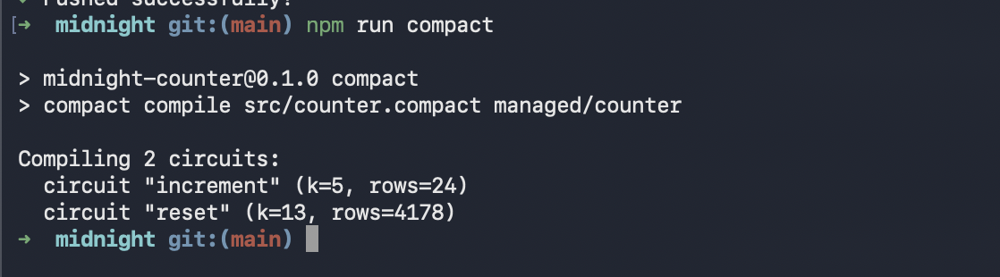
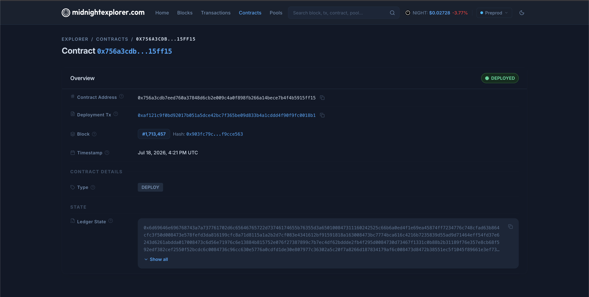

# Midnight Counter

A privacy-preserving counter contract written in [Compact](https://docs.midnight.network/) for the Midnight network.

Anyone can increment the public counter; only the owner — proving knowledge of a secret key inside a zero-knowledge circuit, without revealing it — can reset it.

## Product Idea

The idea: a minimal but complete demonstration of Midnight's core value — selective privacy on a public ledger. A shared counter that anyone can bump is deliberately the simplest possible public state, so all attention goes to the privacy mechanism: administrative control (reset) is gated not by an on-chain address or access list, but by a zero-knowledge proof of knowledge of a secret key that never leaves the owner's machine. The same pattern — public state, privately-authorized mutations — scales up to real products like anonymous voting, private loyalty points, or compliance-gated transfers, and this repo is the smallest end-to-end template for it: Compact contract → local ZK tests → preprod deployment → browser dApp with fee-sponsored transactions.

## Contract

`src/counter.compact` (language ≥ 0.16, compiled with `compactc 0.31.1`):

- **Public ledger**: `round: Counter`, `owner: Bytes<32>` (a hash-derived public key)
- **Witness (private state)**: `localSecretKey(): Bytes<32>` — supplied locally, never published
- **Circuits**: `increment()` (anyone), `reset()` (owner only, enforced by ZK proof)

## Public State vs Private Witness

Midnight contracts split their state into two worlds:

- **Public ledger state** lives on-chain and is visible to everyone. In this contract
  that's `round` (the counter value) and `owner` (a *hash* of the owner's public key).
  Every node and every explorer can read these — they are the shared, verifiable
  source of truth.
- **Private witness state** never touches the chain. The `localSecretKey()` witness is
  a function the *local* runtime answers from the caller's own machine. When the owner
  calls `reset()`, the circuit consumes the secret key **inside a zero-knowledge
  proof**: the network verifies the proof that
  `hash(localSecretKey()) == owner` holds, without the key (or any bits of it) ever
  appearing in the transaction. Anyone inspecting the ledger sees only that a valid
  reset happened — not who holds the key or what the key is.

So `increment()` needs no witness at all (anyone may call it), while `reset()` is a
private-input circuit: public effect, private authorization. The test suite
(`tests/counter.test.ts`) explicitly asserts the secret key never appears in the
public ledger state.

## Prerequisites

- Node.js ≥ 22
- [Compact toolchain](https://docs.midnight.network/relnotes/compact-tools) (`compact` CLI)
- Docker (for the local proof server when deploying)

## Build

```bash
npm install
npm run compact   # compiles src/counter.compact → managed/counter (circuits, ZK keys, TS API)
```

The `managed/counter/` directory contains the generated contract JS/TS API (`contract/`),
ZK IR (`zkir/`), and prover/verifier keys (`keys/`).

## Test

```bash
npm test
```

Runs a vitest suite (`tests/counter.test.ts`) that executes the real compiled circuits
through `@midnight-ntwrk/compact-runtime`, covering initialization, increments,
owner-only reset authorization, and that the secret key never appears on the public ledger.

## Deploy (Preview / Preprod)

```bash
docker-compose up -d --wait proof-server   # local proof server on :6300
npm run deploy
```

The target network is toggled in `.env`:

```bash
MIDNIGHT_NETWORK=preview   # or preprod
```

(Setting `MIDNIGHT_NETWORK` in the shell overrides the `.env` value.) To deploy with
your own wallet, put its secret in `.env.<network>` — either
`MIDNIGHT_<NETWORK>_MNEMONIC=word1 word2 ...` or `MIDNIGHT_<NETWORK>_SEED=<64 hex chars>`
(one of the two). All `.env*` files are gitignored; see `.env.example` for a template
of every supported variable.

The deploy script (`scripts/deploy.ts`):

1. Loads (or generates and saves to `.env.<network>`) a wallet seed and contract owner key
2. Syncs the wallet against the public indexer
3. If the wallet has no tNIGHT, prints its address and waits — fund it manually at the
   network faucet (it is captcha-gated, so this step can't be automated)
4. Registers the NIGHT UTXOs for DUST generation and waits for a positive DUST
   balance (fees are paid in DUST; generation takes a while after registration)
5. Submits the deployment transaction (ZK proofs from the local proof server),
   prints the contract address, and writes `deployments/<network>.json`

`scripts/dust-probe.ts` is a read-only diagnostic that prints the wallet's NIGHT
UTXOs, registration flags, and dust state without deploying anything:

```bash
npx tsx scripts/dust-probe.ts
```

## Web dApp (browser deploy via 1AM wallet)

`dapp/` is a Next.js app (based on
[midnight-skills-counter-dapp](https://github.com/tusharpamnani/midnight-skills-counter-dapp))
that deploys and increments a counter contract straight from the browser using the
[1AM wallet](https://1am.xyz) — 1AM's ProofStation sponsors all DUST fees, so no
faucet or dust generation is needed:

```bash
cd dapp
npm install
npm run build   # compiles dapp/contract/src/counter.compact + syncs ZK assets + next build
npm start       # serves on http://localhost:3000
```

Open <http://localhost:3000/counter> and connect the 1AM extension — the page is
wired to the deployed preprod contract (address below) and lets you read and
increment the counter. (The dApp's contract is the minimal increment-only counter; the root
`src/counter.compact` with the ZK owner-reset remains the contract covered by the
test suite and the Node deploy pipeline.)

## Deployment

<!-- DEPLOYMENT_RECORD -->
**Deployed to preprod.**

| | |
|---|---|
| **Contract Address** | `0x756a3cdb7eed760a37848d6cb2e009c4a0f898fb266a14bece7b4f4b5915ff15` |
| **Deploy Tx** | `0xaf121c9f0bd92017b051a5dce42bc7f365be09d833b4a1cddd4f90f9fc0018b1` |
| **Block Height** | 1,713,457 |
| **Network** | Midnight preprod |
| **Explorer** | [View contract](https://preprod.midnightexplorer.com/contracts/0x756a3cdb7eed760a37848d6cb2e009c4a0f898fb266a14bece7b4f4b5915ff15) |

Deployment record also stored in [`deployments/preprod.json`](deployments/preprod.json).

### Screenshots

Successful compile (`npm run compact`) with the contract circuits listed:



Contract deployed on preprod, address and DEPLOYED status shown in the explorer:


